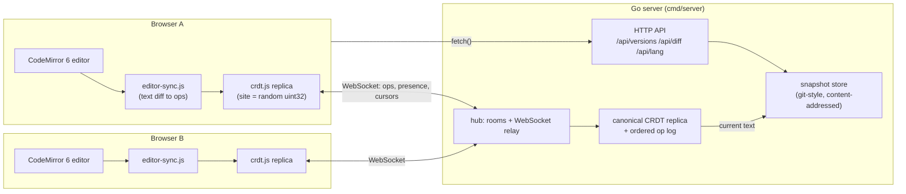
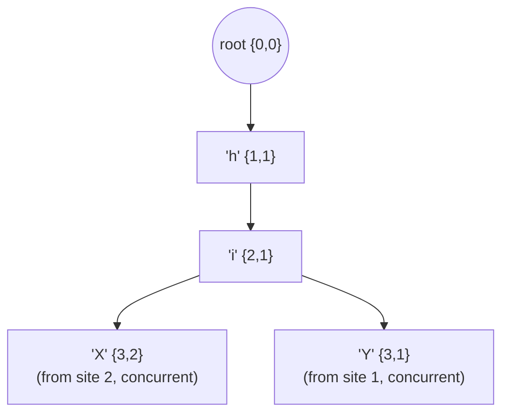
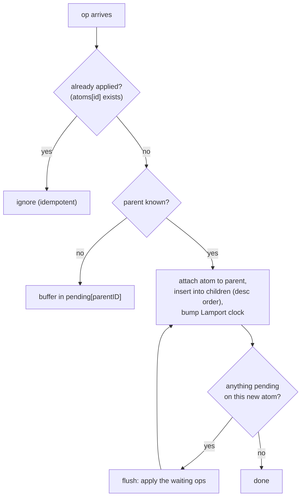
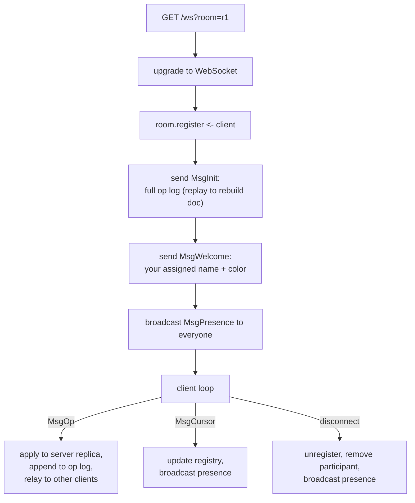
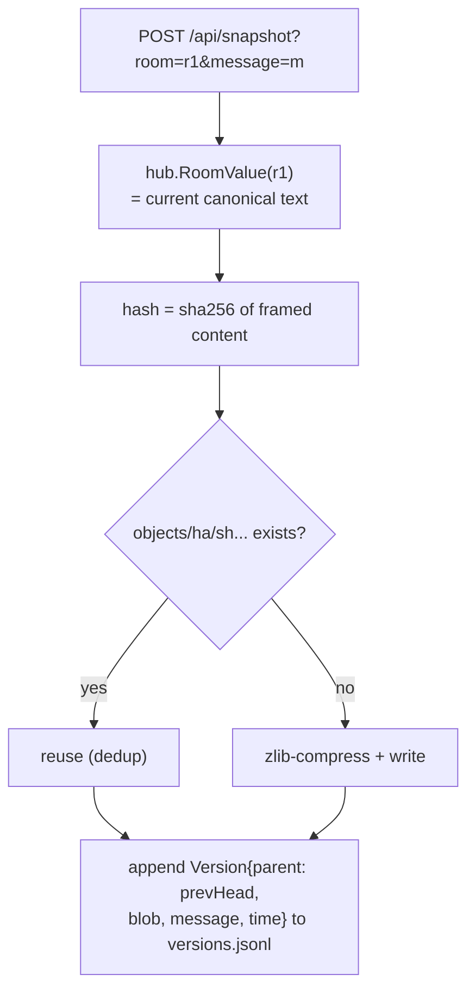

# cocode - Architecture & Design

A real-time collaborative code editor. Multiple people edit the same document
at once; every replica converges to the same text without locks or a central
"who wins" arbiter, because the document is a **CRDT** (Conflict-free
Replicated Data Type) implemented from scratch in both **Go** (server) and
**JavaScript** (browser).

This document explains every part of the system, with flow charts.

---

## 1. System overview



Key idea: **the server and every client run the same CRDT algorithm.** The
server never transforms operations - it only applies them to its own replica
(so it can serve snapshots and late joiners) and relays them to the other
clients in the room. Correctness does not depend on delivery order.

### Package layout

| Path | Role |
|------|------|
| `cmd/server` | HTTP entrypoint: routes, static files, env config (`PORT`, `DATA_DIR`) |
| `internal/crdt` | The sequence CRDT (causal tree / RGA), pure data structure |
| `internal/hub` | WebSocket transport: rooms, clients, op relay, presence |
| `internal/participant` | Presence registry: assigns names/colors, tracks cursors |
| `internal/snapshot` | Git-style version store: content-addressed, zlib-compressed blobs |
| `internal/versiondiff` | LCS line diff between two versions |
| `internal/lang` | Language detection (extension + shebang heuristics) |
| `web/` | Frontend: `crdt.js` (JS port of the CRDT), `editor-sync.js` (diff helpers), `app.js` (wiring), vendored CodeMirror bundle |
| `web-src/` | esbuild entry that produces `web/vendor/cocode-editor.js` (committed, so no build step at runtime) |

---

## 2. The CRDT: causal tree / RGA

### Why a CRDT at all?

If two users insert at the same position at the same time, a naive
"send the whole text" or "send index-based edits" scheme corrupts or drops
text, because each edit was computed against a different version of the
document. The classic options are:

- **Locking** - kills concurrency.
- **Operational Transformation (OT)** - the server must transform every op
  against concurrent ones; correct implementations are notoriously tricky.
- **CRDT** - design the data structure so operations are **commutative** and
  **idempotent**; then any replica can apply any ops in any order and all
  replicas converge. No transformation, no central coordination.

### The model

Every character is an **atom** with:

- a globally unique **ID** `{seq, site}` - `seq` is a Lamport clock, `site`
  identifies the replica that created it;
- a **parent** - the ID of the atom it was inserted *after*.

Atoms form a **tree** rooted at a virtual root `{0,0}`. The visible document is
a **pre-order DFS** of the tree, where each node's children are ordered by
**descending ID**. Deletions never remove atoms - they set a **tombstone**
flag, so concurrent operations that reference a deleted atom still resolve.



Both `X` and `Y` were inserted "after i" concurrently. Sibling order is
descending ID, and `{3,2} > {3,1}`, so **every** replica renders `hiXY` -
a deterministic tie-break with no coordination.

### Why it converges (the core argument)

1. Applying an insert only *attaches a node to its parent*; it never moves or
   re-indexes anything else.
2. Sibling order is a **pure function of the IDs**, not of arrival order.
3. Therefore every replica that has received the same *set* of ops holds the
   exact same tree, regardless of order (**commutativity**).
4. Re-applying a known op is a no-op (**idempotence**).
5. The DFS rendering is deterministic, so same tree means same string.

### Out-of-order delivery

An insert can arrive before its parent. Such ops go into a **pending buffer**
keyed by the missing parent ID; when the parent arrives, the buffer is flushed
recursively.



### Operations on the wire

```json
{"type":"insert","id":{"seq":3,"site":42},"parent":{"seq":2,"site":42},"char":104}
{"type":"delete","id":{"seq":3,"site":42}}
```

`char` is the integer Unicode code point, which is what Go's `rune` marshals
to. The JSON shape is **pinned by tests** (`internal/crdt/wire_test.go`) so
the Go and JS implementations cannot silently drift apart.

---

## 3. Life of a keystroke

```mermaid
sequenceDiagram
    participant U as User A (typing)
    participant CM as CodeMirror A
    participant ES as editor-sync.js
    participant CA as CRDT replica A
    participant S as Server (room goroutine)
    participant CB as CRDT replica B
    participant CMB as CodeMirror B

    U->>CM: types "x"
    CM->>ES: onLocalChange(newText)
    ES->>ES: diff old vs new (common prefix/suffix)
    ES->>CA: localInsert(index, 'x')
    CA-->>ES: op {insert, id, parent, char}
    ES->>S: WebSocket {"type":"op", op}
    S->>S: doc.Apply(op); oplog.append(op)
    S->>CB: relay op to every other client
    CB->>CB: apply(op), compute converged value
    CB->>CMB: reconcile(editorText, crdtText)<br/>single {from,to,insert} change
```

Two details worth knowing:

- **Local edits to ops**: `editor-sync.js` computes the minimal contiguous
  edit (shared prefix + suffix) between the old and new editor text, then
  emits one delete op per removed char and one insert op per added char.
- **Remote ops to editor**: after applying an op to the local CRDT, the client
  diffs the editor text against the CRDT value and dispatches a *single*
  CodeMirror change, annotated as "remote" so the update listener does not
  echo it back as a local edit (which would loop forever).

---

## 4. Rooms, join flow, and presence

The hub keeps one `Room` per document. Each room has exactly **one goroutine**
(`room.run()`) that owns all room state - clients map, canonical CRDT replica,
op log, presence registry. All mutations arrive over channels, so there are no
locks and no data races on room state ("share memory by communicating").



Per-client plumbing (standard gorilla/websocket pattern):

- `readPump` - reads JSON messages, forwards them to the room's channels.
- `writePump` - writes queued messages and periodic pings (with pong deadlines
  to detect dead connections).
- `trySend` - non-blocking send into a buffered channel; a slow client's
  messages are **dropped rather than blocking the room goroutine** (the CRDT
  still converges from later ops).

Presence: `internal/participant` assigns each connection a name/color from a
palette ("Blue Fox", "Green Owl", ...) and tracks a cursor index; the frontend
renders other users' carets as colored widgets inside CodeMirror.

---

## 5. Versioning: git-style snapshots

`internal/snapshot` reimplements the core ideas of Git's object store:

- A version's text is stored as a **content-addressed blob**: framed as
  `blob <len>\0<content>`, hashed with **SHA-256**, zlib-compressed, and
  written under a fan-out directory `objects/ab/cdef...`.
- Identical content is stored **once** (deduplicated by hash).
- Versions form a **parent chain** (like commits), stored per-room as
  append-only JSONL.



`GET /api/diff?a=<v1>&b=<v2>` renders a unified line diff computed with a
classic **LCS dynamic program** (`internal/versiondiff`): `dp[i][j]` = LCS
length of the line suffixes, then walk the table emitting ` `/`-`/`+` lines.

---

## 6. HTTP API

| Method | Path | Description |
|--------|------|-------------|
| `GET`  | `/ws?room=<id>` | WebSocket for real-time collaboration |
| `POST` | `/api/snapshot?room=<id>&message=<m>` | Save current text as a version |
| `GET`  | `/api/versions?room=<id>` | List saved versions |
| `GET`  | `/api/version?room=<id>&id=<vid>` | Fetch one version's content |
| `GET`  | `/api/diff?room=<id>&a=<vid>&b=<vid>` | Unified line diff a -> b |
| `GET`  | `/api/lang?filename=<f>&content=<c>` | Detect language (extension, then shebang) |
| `GET`  | `/healthz` | Liveness probe |

---

## 7. Testing strategy

- **CRDT convergence proofs as tests** (`internal/crdt`): concurrent inserts
  at the same spot, delete-vs-insert races, out-of-order (child-before-parent)
  delivery, and 50 random-shuffle trials asserting every permutation of the op
  set converges to the same string.
- **Wire-format pinning** (`wire_test.go`): asserts the exact JSON field names
  and that a rune serialises as an integer code point, keeping Go and JS
  interoperable.
- **Integration tests over real WebSockets** (`internal/hub`): two clients
  converge end-to-end; a late joiner rebuilds the doc from the init log;
  presence counts update.
- **Unit tests** for snapshots (dedup, parent chain), diff, language
  detection, and the participant registry.

Run everything with `go test ./...`.

---

## 8. Deployment

Two-stage `Dockerfile`: a `golang:alpine` build stage produces a static,
CGO-free binary (`-trimpath -ldflags="-s -w"`); the runtime stage is plain
`alpine` with a non-root user, the binary, and the `web/` assets. The server
reads `PORT` and `DATA_DIR` from the environment, and the frontend picks
`ws://` vs `wss://` from `location.protocol`, so the same image runs behind
any TLS-terminating proxy. Deployed on Hugging Face Spaces (Docker SDK).

---

## 9. Known limitations / conscious trade-offs

Deliberate scope decisions for an MVP; each has a clear fix:

- **Op log grows forever.** Late joiners replay the entire history and
  tombstones are never garbage-collected. Fix: periodic state snapshots (send
  the tree, not the log) plus tombstone GC once all replicas have acknowledged
  a delete (requires version vectors).
- **Rooms are never reaped.** An empty room's goroutine and op log stay in
  memory. Fix: shut down and persist a room after the last client leaves.
- **O(n) index lookups.** Mapping index to atom walks the visible IDs on every
  op. Fine at human-typed document sizes; a production editor would keep a
  balanced tree or weighted skip list for O(log n).
- **No auth, open origin check.** Anyone who knows a room name can join, and
  the WebSocket upgrade accepts any `Origin` (documented in the code; fine for
  a public demo).
- **Cursor positions are plain indexes,** not CRDT positions, so a remote
  caret can be momentarily off while edits are in flight (it self-corrects on
  the next presence update).
- **Characters outside the BMP** (e.g. emoji) can split into two ops on the JS
  side because `editor-sync.js` iterates UTF-16 code units. Fix: iterate by
  code points.
